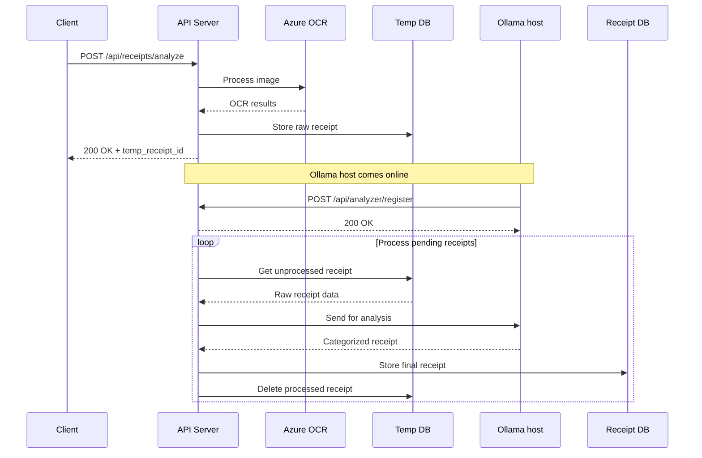

#  expense_flow

Guides families through their spending patterns with clear direction!


## System overview



## Useful scripts:

  1. Run local receipt analysis or serve an endpoint
```
  ❯ ./run.sh
  Usage: ./run.sh [command] [options]
  Commands:
    analyze path/to/receipt.{jpg,png,pdf,json} [--llm-type local|chatgpt]
    serve [--host HOST] [--port PORT]
```

  2. Analyze all of the receipts in given directory (json format required)
```  
  ❯ ./process_all.sh
  Usage: ./process_all.sh <path_to_json_directory> [--llm-type local|chatgpt]
  Example: ./process_all.sh /path/to/jsons --llm-type local
```

  3. Db backup script (backup.py) and lanuchd setup
```  
  ❯ ./setup_backup.sh
  Usage: ./setup_backup.sh /path/to/backup_script.py
```

  4. Receipt analyze validation
```  
  ❯ ./validation.py
  usage: validation.py [-h] [-v] source_dir result_dir
  validation.py: error: the following arguments are required: source_dir, result_dir

  result_dir: processed output from ./process_all.sh or ./run.sh analyze
  source_dir: propely categorized data to validate against
```

## Setup

### Env vars:
```
EXPENSE_FLOW_API_KEY
AZURE_DOCUMENT_ENDPOINT
AZURE_DOCUMENT_KEY
CHATGPT_KEY
OLLAMA_HOST
```

mobile needs .env with:
```
BASE_URL
API_KEY
```
The rest is optional.


### API host: 
  - setup python '```ai_venv```' env and activate
  - ```pip install -r requirements.txt```
  - ```./run.sh serve```
  - ```./setup_backup.sh```

### Ollama host:
Register it's readiness for LLM processing with:
```
curl -X POST "[BASE_URL]:8000/api/analyzer/register" \
-H "X-API-Key: [EXPENSE_FLOW_API_KEY]"
```

  It can be automated for example as a systemd service and network-online trigger.

```
cat /etc/systemd/system/expense-flow-register.service

[Unit]
Description=Register with Expense Flow API
After=network-online.target
Wants=network-online.target

[Service]
Type=oneshot
Environment=EXPENSE_FLOW_API_KEY=[KEY]
ExecStart=[FULL_PATH]/_autostart/expense-flow-register-service.sh
RemainAfterExit=yes

[Install]
WantedBy=multi-user.target
```

Register service with:
```
sudo systemctl enable expense-flow-register.service
sudo systemctl start expense-flow-register.service
```
Shell script
```expense-flow-register-service.sh``` hits ```/api/analyzer/register``` endpoint.

## Sample requests
API docs: ```http://[BACKEND_IP]:8000/docs```

```
curl -X POST "[BACKEND_IP]:8000/api/receipts/analyze" \
-H "accept: application/json" \
-H "X-API-Key: your_api_key" \
-F "file=@path/to/your/receipt.jpg" \
-F "llm_type=local"
```

```
curl -X GET "[BACKEND_IP]:8000/api/categories" \
-H "accept: application/json" \
-H "X-API-Key: [EXPENSE_FLOW_API_KEY]"
```

```
curl -X GET "[BACKEND_IP]:8000/api/months/summary" \
-H "accept: application/json" \
-H "X-API-Key: [EXPENSE_FLOW_API_KEY]"
```
